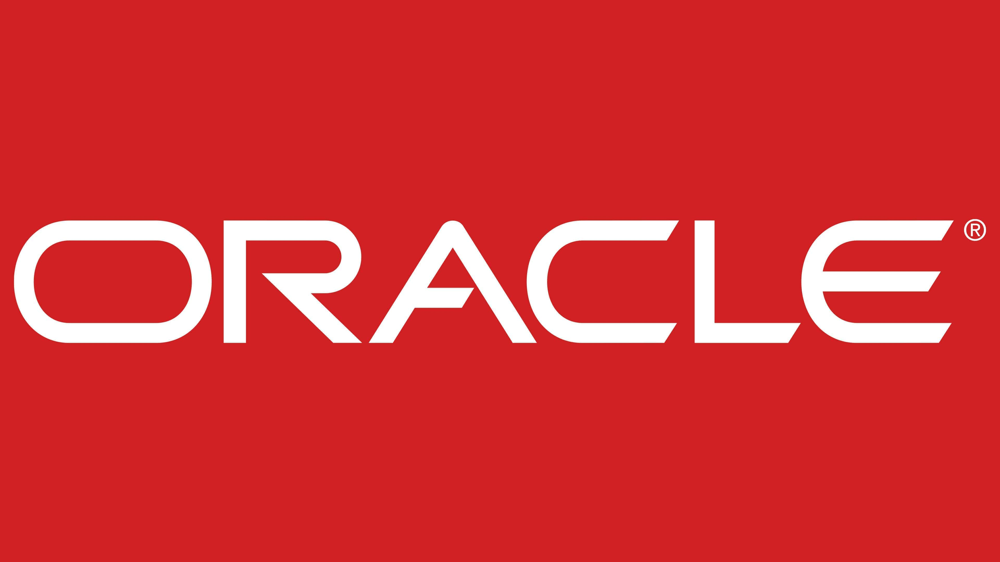

# Entregável Java 01 – POO

________________________________________

# Parte 1 – Histórico e Evolução do Java

## 1.1 Criação do Java e seus Criadores

O Java foi oficialmente lançado em 1995, sendo desenvolvido por uma equipe da Sun Microsystems liderada por James Gosling, junto com engenheiros como Mike Sheridan e Patrick Naughton.

No entanto, a história do Java começa antes, em 1991, com o chamado Projeto Green, que tinha um objetivo bem diferente do atual: criar uma linguagem para dispositivos eletrônicos inteligentes, como TVs interativas e eletrodomésticos. Algo parecido com o que conhecemos hoje como Internet das Coisas (IoT).

### Curiosidade:

O Java quase não existiu como conhecemos hoje. O projeto inicial não teve sucesso comercial, e só ganhou força quando a equipe decidiu adaptá-lo para a internet, que estava em crescimento naquela época.

<p align="center">
  
</p>

________________________________________

## 1.2 Empresa Responsável Antes e Depois de 2010

Antes de 2010, o Java era mantido pela Sun Microsystems, uma empresa que defendia fortemente o uso de tecnologias abertas.

Em 2010, a Oracle Corporation adquiriu a Sun Microsystems, passando a ser responsável pelo Java.

Essa mudança gerou discussões na comunidade, pois muitos desenvolvedores temiam que o Java se tornasse menos aberto. Isso contribuiu para o fortalecimento do OpenJDK, uma versão open source do Java amplamente usada hoje.

Hoje, a Oracle mantém o Java com foco forte em mercado corporativo, cloud e performance.

<p align="center">
  
</p>

________________________________________

## 1.3 Objetivo Principal e Impacto na Programação Moderna

O principal objetivo do Java sempre foi permitir que um programa pudesse rodar em diferentes sistemas sem precisar ser reescrito. Isso é representado pelo famoso conceito:

> “Write Once, Run Anywhere”

Isso é possível graças à JVM (Java Virtual Machine), que interpreta o código Java em diferentes sistemas operacionais.

### Impacto na Programação

- Facilitou o desenvolvimento multiplataforma.
- Tornou o Java referência em sistemas corporativos.
- Influenciou linguagens como Kotlin, Scala e até C#.

________________________________________

## 1.4 Principais Versões do Java

### Java 1.0 (1996): O Nascimento

Foi o ponto de partida oficial. O grande diferencial aqui não era a performance, mas a JVM (Java Virtual Machine). Pela primeira vez, um desenvolvedor podia escrever um código no Windows e ele rodaria no Linux ou Unix sem precisar ser recompilado.

________________________________________

### Java 2 (JDK 1.2 - 1998): Maturidade

Embora o nome técnico fosse JDK 1.2, a Sun o rebatizou como Java 2 para mostrar que a linguagem estava pronta para o mercado corporativo.

#### Collections Framework:

Antes, cada programador organizava dados de um jeito. O Collections padronizou listas, mapas e conjuntos.

#### Swing:

Permitiu criar interfaces gráficas (janelas, botões) muito mais bonitas e flexíveis que as da versão 1.0.

________________________________________

### Java 5 (2004): Modernização da Sintaxe

#### Generics:

Acabou com a necessidade de ficar fazendo “cast” (conversão manual) de objetos o tempo todo, evitando erros clássicos de ClassCastException.

#### Annotations:

Permitiu colocar metadados no código (como o @Override), o que abriu portas para frameworks modernos como o Spring.

________________________________________

### Java 8 (2014): O Salto Funcional

#### Lambdas e Streams:

O Java, que era puramente orientado a objetos, aceitou conceitos de programação funcional. Isso permitiu processar listas de dados com muito menos linhas de código e de forma mais legível.

#### Nova API de Data:

Corrigiu a confusão que era trabalhar com datas e calendários nas versões anteriores.

________________________________________

### Java 11 (2018): Eficiência e Nuvem

Aqui o Java mudou seu modelo de licenciamento e ritmo de lançamentos (agora a cada 6 meses).

#### LTS (Long Term Support):

Tornou-se a versão de referência para empresas que buscam estabilidade.

#### HTTP Client Moderno:

Facilitou a comunicação com APIs da web, algo essencial na era dos microserviços e da nuvem.

________________________________________

### Java 17 (2021): Código Limpo e Seguro

Focada em tornar a linguagem menos “verbosa” (menos escrita para fazer a mesma coisa).

#### Records:

Uma forma rápida de criar classes que servem apenas para carregar dados, eliminando a necessidade de escrever Getters, Setters e toString manualmente.

#### Sealed Classes:

Maior controle sobre a hierarquia de herança, aumentando a segurança do design do software.

________________________________________

### Java 21 (2023): Alta Escalabilidade

#### Virtual Threads:

Talvez a maior mudança interna na JVM em décadas. Elas permitem que um servidor suporte milhões de tarefas simultâneas usando muito menos memória do que as threads tradicionais.

________________________________________

# Parte 2 – Ambientes de Desenvolvimento (IDEs)

## 2.1 Comparativo de Ambientes de Desenvolvimento (IDEs) Java

| IDE | Foco Principal | Vantagens | Desvantagens |
|---|---|---|---|
| IntelliJ IDEA | Performance e Modernidade | Produtividade elevada: o autocompletar (Smart Completion) entende o contexto do código, sugerindo soluções antes mesmo de você terminar de digitar. Refatoração segura: possui ferramentas confiáveis para renomear ou mover arquivos sem quebrar o projeto. | A versão Ultimate requer assinatura. Além disso, exige quantidade considerável de memória RAM (mínimo 8GB recomendados). |
| Eclipse IDE | Personalização e Corporativo | Ecossistema de plugins: existe um plugin para quase qualquer tecnologia existente. Gerenciamento de projetos robusto para múltiplos projetos grandes e complexos. | Interface com muitos menus e janelas, podendo confundir iniciantes. Frequentemente exige configurações manuais. |
| Apache NetBeans | Educação e Simplicidade | “Out of the Box”: exige pouca configuração inicial. Interface visual excelente para criação de telas (GUI Builder). | Evolução mais lenta em comparação às outras IDEs. Comunidade menor e menos tutoriais atualizados. |

________________________________________

## 2.2 Demonstração Visual das Interfaces

### IntelliJ IDEA

<!------IMAGEM DO INTELLIJ AQUI-------->


### Eclipse IDE

<!-- IMAGEM DO ECLIPSE AQUI -->


### Apache NetBeans

<!-- IMAGEM DO NETBEANS AQUI -->


________________________________________

## 2.3 Melhor IDE para os Estudos: IntelliJ IDEA

A escolha pelo IntelliJ IDEA justifica-se por sua inteligência proativa, que funciona como um tutor em tempo real. Diferente do Eclipse ou NetBeans, ele oferece sugestões de melhoria e correções automáticas que ensinam boas práticas enquanto o código é escrito.

Essa assistência reduz o tempo gasto com configurações e erros sintáticos, permitindo um foco maior nos conceitos de Programação Orientada a Objetos e uma preparação mais eficiente para as exigências atuais do mercado.

________________________________________

# Parte 3 – Paradigma de Programação Orientado a Objetos (POO)

## 3.1 Classe e Objeto

Classe

É uma estrutura que define as características (atributos) e comportamentos (métodos) que um determinado tipo de objeto terá. Ela funciona como um modelo usado para criar objetos.

Objeto

É uma instância concreta de uma classe, ou seja, um elemento criado a partir desse modelo, com valores próprios para seus atributos e capaz de executar os métodos definidos na classe.

```java
// Classe: O modelo para todos os filmes
class Filme {
    String titulo;
    int duracao;

    void reproduzir() {
        System.out.println("Reproduzindo: " + titulo);
    }
}

// Objeto: Um filme real criado a partir do modelo
Filme filmeFavorito = new Filme();
filmeFavorito.titulo = "Inception";
filmeFavorito.reproduzir();
```

________________________________________

## 3.2 Encapsulamento

Serve para “esconder” os detalhes internos de como um objeto funciona e proteger seus dados. Isso é feito usando modificadores de acesso (como private) e métodos get e set.

```java
public class Usuario {
    private String senha; // Oculto para proteção

    // Setter com regra de negócio
    public void setSenha(String novaSenha) {
        if (novaSenha.length() >= 6) {
            senha = novaSenha;
        } else {
            System.out.println("Erro: A senha deve ter no mínimo 6 caracteres.");
        }
    }

    // Método de uso seguro (não revela a senha, apenas valida)
    public boolean autenticar(String senhaDigitada) {
        return senha != null && senha.equals(senhaDigitada);
    }
}
```

________________________________________

## 3.3 Herança

Permite que uma classe (filha) herde atributos e métodos de outra classe (pai). Isso evita a repetição de código e cria uma hierarquia.

```java
class Animal {
    void comer() {
        System.out.println("Comendo...");
    }
}

class Cachorro extends Animal { // Cachorro herda de Animal
    void latir() {
        System.out.println("Au Au!");
    }
}
```

________________________________________

## 3.4 Polimorfismo

Significa “muitas formas”. É a capacidade de um objeto ser tratado como sua classe pai, mas executar comportamentos específicos da sua classe real. Ocorre muito através da sobrescrita de métodos (@Override).

```java
class Pagamento {
    void processar() {
        System.out.println("Processando pagamento genérico...");
    }
}

class Cartao extends Pagamento {
    @Override
    void processar() {
        System.out.println("Validando limite do cartão...");
    }
}

class Pix extends Pagamento {
    @Override
    void processar() {
        System.out.println("Gerando QR Code...");
    }
}
```

________________________________________

# Parte 4 – Mercado de Trabalho para Desenvolvedores Java

## 4.1 Salário Médio no Brasil

Os salários de desenvolvedores Java no Brasil variam conforme a experiência, região e tipo de empresa. Com base em pesquisas recentes:

- Júnior: entre R$ 2.000 e R$ 4.000/mês, com média próxima de R$ 3.000.
- Pleno: entre R$ 7.000 e R$ 12.000/mês.
- Sênior: entre R$ 13.000 e R$ 20.000/mês, podendo ser maior em empresas grandes.

________________________________________

## 4.2 Áreas de Atuação do Java

A versatilidade do Java permite que ele seja aplicado em setores fundamentais da economia digital. As cinco principais áreas são:

1. Sistemas Bancários: padrão ouro em segurança e robustez para transações financeiras.
2. Back-end Web: criação de APIs e servidores escaláveis que sustentam grandes portais.
3. Big Data: base de ferramentas que processam volumes massivos de dados (ex: Apache Hadoop).
4. Aplicações Corporativas: desenvolvimento de softwares de gestão (ERP) para multinacionais.
5. Android: ecossistema mobile, onde o Java ainda é a base de bibliotecas e aplicativos legados.

________________________________________

## 4.3 Tecnologias e Frameworks Exigidos

Para ser competitivo no mercado, não basta saber apenas a sintaxe do Java; as empresas buscam domínio em um ecossistema de ferramentas:

1. Spring Boot: o framework mais importante para Java atualmente. Ele facilita a criação de microserviços e aplicações web prontas para produção.
2. Hibernate (JPA): ferramenta essencial para persistência de dados, que mapeia as classes Java para tabelas no banco de dados (ORM).
3. Docker: tecnologia de containerização usada para garantir que o sistema rode da mesma forma em qualquer computador ou servidor.
4. Maven ou Gradle: ferramentas de automação de compilação e gerenciamento de dependências.
5. JUnit: framework fundamental para criação de testes unitários, garantindo que o código seja confiável e livre de bugs antes do lançamento.
